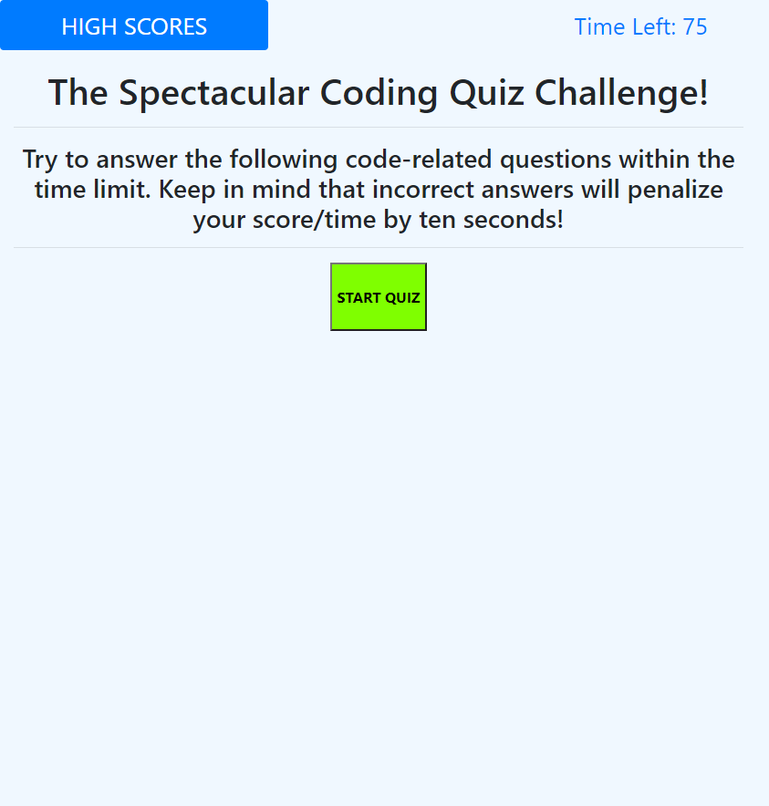
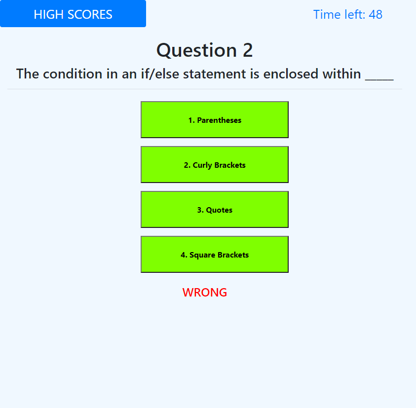

# The Spectacular Code Quiz

## Description

For this project, we were tasked with building a short, interactive quiz about code using what we'd learned in Javascript. It would heavily rely on building functions, adding event listeners, and utilizing local storage among many other elements. 

---------------------------

The deployed and functional site can be found here: <https://spencerv86.github.io/the-spectacular-code-quiz/>

The full process can be found on my [Github](https://github.com/spencerv86/the-spectacular-code-quiz) repository linked here:
<https://github.com/spencerv86/the-spectacular-code-quiz>

----------------
## Table of Contents

* [Installation](#installation)
* [Usage](#usage)
* [Credits](#credits)
* [License](#license)

------------
## Installation

To install, fork repository [found here](https://github.com/spencerv86/the-spectacular-code-quiz), then clone to your computer and open in Visual Studio Code or your preferred interface. 

------------
## Usage

To use this quiz, first read the instructions and press the big Start button at the bottom of the box.

Once you've clicked start the questions will appear one by one after the page. If you get answer correct, you will be greeted with a "Good Job", but if you get an answer wrong you'll lose ten seconds from your score and see a depressing "WRONG".

After you've either run out of time or have answered all the questions, you will have the option of entering your initials to save your high score! If you choose to do so, you'll be taken to the High Scores page with a notice of your score.

## Credits

Thanks to Peter the TA for getting me on the right track and a trillion thanks to the endlessly helpful members of my cohort. 

------------
## License

MIT License

Copyright (c) [2020] [Spencer Vaughan]

Permission is hereby granted, free of charge, to any person obtaining a copy
of this software and associated documentation files (the "Software"), to deal
in the Software without restriction, including without limitation the rights
to use, copy, modify, merge, publish, distribute, sublicense, and/or sell
copies of the Software, and to permit persons to whom the Software is
furnished to do so, subject to the following conditions:

The above copyright notice and this permission notice shall be included in all
copies or substantial portions of the Software.

THE SOFTWARE IS PROVIDED "AS IS", WITHOUT WARRANTY OF ANY KIND, EXPRESS OR
IMPLIED, INCLUDING BUT NOT LIMITED TO THE WARRANTIES OF MERCHANTABILITY,
FITNESS FOR A PARTICULAR PURPOSE AND NONINFRINGEMENT. IN NO EVENT SHALL THE
AUTHORS OR COPYRIGHT HOLDERS BE LIABLE FOR ANY CLAIM, DAMAGES OR OTHER
LIABILITY, WHETHER IN AN ACTION OF CONTRACT, TORT OR OTHERWISE, ARISING FROM,
OUT OF OR IN CONNECTION WITH THE SOFTWARE OR THE USE OR OTHER DEALINGS IN THE
SOFTWARE.

